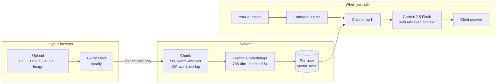
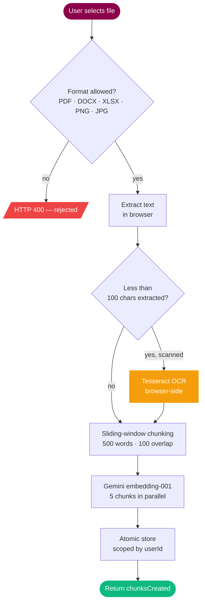
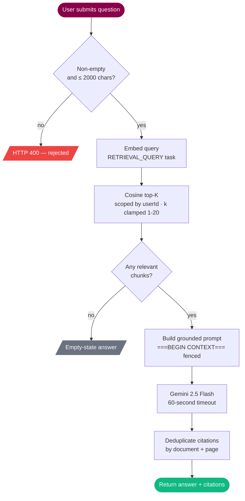

<div align="center">

<br />

# ASK Docs

### **Upload a document. Ask anything. Get cited, grounded answers.**

A privacy-first **Retrieval-Augmented Generation** application.
Your file never leaves your browser. Every answer is traceable to a page.

<br />

<a href="https://aditya-raj19-askdocs.hf.space/">
  
</a>

<br />
<br />

<p>
  
  
  
  
  
  
  
  
</p>

</div>

<br />

---

## The problem

Large language models confidently invent facts that aren't in your document — and they can't read your private files at all. A bare chat with GPT or Gemini can't tell you what page 14 of *your* report says, and if you paste a paragraph in, it might still mix in details from its training data.

## The solution

ASK Docs uses **Retrieval-Augmented Generation**. Your document is chunked, embedded into a vector space, and indexed under your user ID. When you ask a question, the *question* is embedded too — the top-K most semantically similar chunks are pulled back and given to Gemini as grounding context. The model is instructed to answer **only** from those chunks, citing the source page on every claim. If the answer isn't in your document, it says so.

> No hallucinations. Full source traceability. Your data never trains anyone's model.

<br />

---

## How it works



<br />

---

## The pipelines

#### Upload pipeline



#### Query pipeline



<br />

---

## Features

<table>
<tr>
<td width="50%" valign="top">

### Built for accuracy

- **Inline citations** on every answer — filename + page number
- **Strict prompt fencing** prevents context injection
- Says *"I don't know"* instead of making things up
- **Cosine-similarity top-K** retrieval

</td>
<td width="50%" valign="top">

### Built for privacy

- Your file is **extracted in the browser** — never reaches the server
- **Per-user vector isolation** by Firebase UID
- **All chunks wiped on tab close** via sessionStorage signal
- Full CSP, JWT auth, zero cookies, **no CSRF surface**

</td>
</tr>
<tr>
<td width="50%" valign="top">

### Built for speed

- **Parallel embedding** — 5 chunks at a time
- **Hashed-asset** immutable caching
- **Lazy-loaded OCR** (only paid for if you upload an image)
- **Atomic re-uploads** — old data is kept until the new version succeeds

</td>
<td width="50%" valign="top">

### Built for real use

- Five file formats — **PDF, DOCX, XLSX, PNG, JPG**
- **Tesseract OCR fallback** for scanned documents
- **Chat export to styled PDF** with branded header & avatars
- **Mobile-responsive** slide-in sidebar overlay

</td>
</tr>
</table>

<br />

---

## Tech stack

| Layer | Choice | Notes |
|-------|--------|-------|
| **Frontend** | React 18 · Vite · Tailwind | Code-split per route; `pdf.js`, `xlsx`, `tesseract.js` all lazy-loaded |
| **Auth** | Firebase Google OAuth | Server verifies the JWT against Google's x509 certs (cached 6 hrs) |
| **LLM** | Gemini 2.5 Flash | Fast · cheap · citation-friendly |
| **Embeddings** | `gemini-embedding-001` | 768-dim vectors, batched 5-parallel |
| **Vector store** | Hand-rolled JSON + cosine similarity | Zero deps; atomic `tmp + rename` writes |
| **Backend** | Node 20 + Express | Single container; serves both API and React build |
| **OCR** | tesseract.js | Browser-side — no cloud OCR cost |
| **Deploy** | Docker → Hugging Face Spaces | Also runs on Render, Fly, Railway |

A legacy **Python / FastAPI** backend lives in [`backend/`](backend/) using ChromaDB. It's kept as a reference but not maintained or deployed — all current work is on the Node stack.

<br />

---

## Quick start

You need a [Google Gemini API key](https://aistudio.google.com/) (free tier works) and a [Firebase project](https://console.firebase.google.com/) with Google sign-in enabled.

```bash
git clone https://github.com/ADiTyaRaj8969/AsksDocs.git
cd AsksDocs

# Backend
cd server
npm install
cp .env.example .env          # add GEMINI_API_KEY=...
npm run dev                   # API on :5000

# Frontend (new terminal)
cd frontend
npm install
cp .env.example .env          # add VITE_FIREBASE_* values
npm run dev                   # UI on :5173
```

Open <http://localhost:5173>, sign in, drop a PDF in the sidebar, ask away.

<br />

---

## Deploy

<details>
<summary><b>Hugging Face Spaces (one command)</b></summary>

<br />

The repo *is* the Space. One [`Dockerfile`](Dockerfile) builds the frontend and serves it from the same Node process on port 7860. The YAML frontmatter at the top of this README is what HF reads to provision the Space.

```bash
git remote add hf https://huggingface.co/spaces/<your-username>/<space-name>
git push hf main:main
```

Add `GEMINI_API_KEY` and your `VITE_FIREBASE_*` values as **Space secrets** in the HF settings.

</details>

<details>
<summary><b>Docker (anywhere)</b></summary>

<br />

```bash
docker build -t askdocs .
docker run -p 7860:7860 -e GEMINI_API_KEY=... askdocs
```

</details>

<details>
<summary><b>Render</b></summary>

<br />

A [`render.yaml`](render.yaml) is included for one-click deploys, with a persistent disk mounted at `/app/server/data` so vectors survive restarts.

</details>

<br />

---

## Configuration

| Variable | Side | Required | Default | Purpose |
|----------|------|----------|---------|---------|
| `GEMINI_API_KEY` | server | yes | — | LLM + embeddings credential |
| `PORT` | server | no | `5000` | API listen port (HF expects `7860`) |
| `DATA_DIR` | server | no | `server/vector_db` | Where `store.json` lives. Mount a persistent volume here. |
| `ALLOWED_ORIGINS` | server | no | — | Comma-separated extra CORS origins |
| `SPACE_HOST` | server | auto | — | Injected by HF Spaces — auto-allowed in CORS |
| `VITE_FIREBASE_*` | frontend | yes | — | From Firebase Console → Project settings → web app |

<br />

---

## Security model

This is genuinely the strongest part of the project. Worth reading if you plan to host it for real users.

| Threat | Defense |
|--------|---------|
| **User A reads User B's data** | Every vector-store op scopes by `req.user.uid`. No code path returns a chunk without a matching UID. |
| **Prompt injection from the document** | Retrieved context is fenced with `===BEGIN CONTEXT===` markers; the system prompt explicitly tells Gemini to ignore instructions found in context. |
| **Token replay / CSRF** | Server verifies the Firebase JWT against Google's x509 certs (cached 6 hrs). Bearer-only — no cookies — so CSRF is structurally impossible. |
| **Path traversal** | Document names sanitised (`/` and `\` stripped, 255-char cap). All file ops in `try / catch`. |
| **Resource exhaustion** | Per-IP rate limits (10 uploads · 30 queries · 60 doc ops per minute). 60s LLM timeout. 5K-chunk-per-doc and 25K-chunk-per-user caps. |
| **XSS / clickjacking** | Full CSP with `frame-ancestors` allowlisted to `self` + HF Spaces. `script-src 'self'`. No `unsafe-eval`. |
| **Data persistence after use** | Closing the tab clears a `sessionStorage` flag, triggering `DELETE /api/documents` to wipe all of your vectors server-side. |
| **Vulnerable dependencies** | `npm audit --omit=dev` reports **0 vulnerabilities** in both projects. |

<br />

---

## API reference

All endpoints require `Authorization: Bearer <firebase-jwt>` and are rate-limited per IP.

| Method | Path | Body | Returns |
|--------|------|------|---------|
| `POST` | `/api/upload` | `{ documentName, chunks: [{ text, pageNumber }] }` | `{ message, documentName, chunksCreated }` |
| `POST` | `/api/query` | `{ question, top_k? }` *(clamped 1–20)* | `{ answer, citations: [{ documentName, pageNumber, chunkText, score }] }` |
| `GET`  | `/api/documents` | — | `{ documents: [{ name, chunks, size }] }` |
| `DELETE` | `/api/documents/:name` | — | `{ message }` |
| `DELETE` | `/api/documents` | — | Wipes all of your data (used for session reset) |
| `GET`  | `/health` | — | `{ status, version, timestamp }` *(public, no auth)* |

<br />

---

## Project structure

```
AsksDocs/
├── server/                  Node + Express API
│   ├── index.js             entrypoint · CSP · rate limits · static serve
│   ├── middleware/auth.js   Firebase JWT verification
│   ├── routes/              upload · query · documents
│   └── services/            embedder · llm · vectorStore
├── frontend/                React + Vite SPA
│   ├── src/components/      ChatInterface · FileUpload · DocumentList · HomePage
│   ├── src/contexts/        AuthContext
│   ├── src/lib/             firebase · chunker · extractor (with OCR fallback)
│   └── src/api/api.js       axios client with bearer token attached
├── docs/                    Architecture diagrams (referenced by this README)
├── backend/                 Legacy Python/FastAPI implementation (not deployed)
├── Dockerfile               Multi-stage: build frontend → run server
├── render.yaml              Render deploy config
└── README.md                ← you are here
```

<br />

---

## Known limitations

These are honest gaps, not hidden bugs.

- **No streaming responses** — Gemini's full answer arrives in one shot. Token-by-token streaming would be a nice future addition.
- **In-memory vector store** — `store.json` is loaded into memory at startup. Fine up to a few hundred thousand chunks; past that, swap in ChromaDB or pgvector.
- **Single-turn Q&A** — each question is answered independently. There's no "based on what you said earlier" follow-up support.
- **Free Gemini tier rate-limits** — if you see *"quota exceeded"*, you've hit the per-minute or per-day cap.
- **No automated tests** — manual smoke testing only. The biggest gap if you intend production use.

<br />

---

## License

[MIT](LICENSE) © 2026 Aditya Raj.

<br />

<div align="center">

**[Live demo](https://aditya-raj19-askdocs.hf.space/) · [Source on GitHub](https://github.com/ADiTyaRaj8969/AsksDocs) · [Report an issue](https://github.com/ADiTyaRaj8969/AsksDocs/issues)**

</div>
