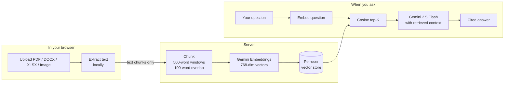

# ASK Docs

**Upload a document. Ask anything. Get cited answers grounded in the source.**

[](https://aditya-raj19-askdocs.hf.space/)


---

## What is this

ASK Docs is a privacy-first **Retrieval-Augmented Generation (RAG)** app. Sign in with Google, upload a PDF / DOCX / XLSX / image, and chat with it. Every answer is grounded in your document and references the exact filename and page it came from — so you can verify the source instead of trusting the model.

The original file never leaves your browser. Only the extracted text chunks are sent to the server for embedding, and **everything is wiped when you close the tab**.

---

## Why RAG, not "just an LLM"

A bare LLM has two problems for document Q&A:

1. **Hallucinations** — it confidently invents facts that aren't in your document.
2. **No access** — it can't read your private files at all.

RAG fixes both. Instead of asking the model to remember everything, you give it a short, relevant slice of your document right before the question. The model is told: *answer only from this slice; if it's not in there, say so.* No hallucinations. Full source traceability. Your data stays out of any training pipeline.

---

## How it works



**The whole loop:** text extraction in the browser → chunk → embed → store → embed query → cosine top-K retrieval → grounded prompt → Gemini → cited answer.

---

## Features

- **Five file formats** — PDF, DOCX, XLSX/XLS, PNG, JPG. Scanned PDFs and images route through Tesseract OCR automatically.
- **Browser-side extraction** — your original file never reaches the server. Only the text content does.
- **Inline citations** — every claim cites a filename and page number. Click to expand the source chunk.
- **Per-user isolation** — every vector in storage is tagged with your Firebase UID. There's no API path to read another user's data.
- **Ephemeral sessions** — closing the tab clears your chat history *and* tells the server to wipe your embedded chunks.
- **Parallel embedding** — chunks are embedded 5 at a time, so a 100-chunk doc finishes in seconds, not minutes.
- **Locked-down API** — strict CORS, full CSP, per-IP rate limits, JWT-verified bearer auth, atomic re-uploads (old data is only deleted once the new version succeeds).
- **Chat export** — download the full conversation as a styled PDF with branded header, avatars, and rendered markdown.

---

## Tech stack

| Layer | Choice | Notes |
|-------|--------|-------|
| Frontend | React 18, Vite, Tailwind | Code-split per route; pdfjs + xlsx lazy-loaded |
| Auth | Firebase Google OAuth | Server verifies JWT via Google's x509 certs (cached 6 hrs) |
| LLM | Gemini 2.5 Flash | Cheap, fast, citation-friendly |
| Embeddings | `gemini-embedding-001` | 768-dim, batched 5-parallel |
| Vector store | Hand-rolled JSON + cosine similarity | Zero deps; atomic tmp+rename writes |
| Backend | Node 20 + Express | Single container, simple deploy |
| OCR | tesseract.js | Lazy-loaded — only paid for if you upload an image |
| Deploy | Docker → Hugging Face Spaces | Also runs on Render, Fly, Railway |

There's also a legacy **Python/FastAPI** backend in [`backend/`](backend/) that uses ChromaDB for vector search. It's not maintained or deployed — kept for reference only. All current development is on the Node stack.

---

## Quick start

You need a [Google Gemini API key](https://aistudio.google.com/) (free tier works) and a [Firebase project](https://console.firebase.google.com/) with Google sign-in enabled.

```bash
# 1. Clone
git clone https://github.com/ADiTyaRaj8969/AsksDocs.git
cd AsksDocs

# 2. Server
cd server
npm install
cp .env.example .env       # then add GEMINI_API_KEY=...
npm run dev                # API on :5000

# 3. Frontend (new terminal)
cd frontend
npm install
cp .env.example .env       # then add VITE_FIREBASE_* values
npm run dev                # UI on :5173
```

Open `http://localhost:5173`, sign in, drop a PDF in the sidebar, ask away.

---

## Deploy

### Hugging Face Spaces

The repo *is* the Space. One Dockerfile builds the frontend and serves it from the same Node process on port 7860 (HF's required port). The YAML frontmatter at the top of this README is what HF reads to provision the Space.

```bash
git remote add hf https://huggingface.co/spaces/<your-username>/<space-name>
git push hf main:main
```

Add `GEMINI_API_KEY` and your `VITE_FIREBASE_*` values as Space secrets in the HF UI.

### Docker (anywhere)

```bash
docker build -t askdocs .
docker run -p 7860:7860 -e GEMINI_API_KEY=... askdocs
```

### Render

A [`render.yaml`](render.yaml) is included for one-click deploys with a persistent disk at `/app/server/data` so vectors survive restarts.

---

## Configuration

| Variable | Side | Required | Default | Purpose |
|----------|------|----------|---------|---------|
| `GEMINI_API_KEY` | server | yes | — | LLM + embeddings credential |
| `PORT` | server | no | `5000` | API listen port (HF expects `7860`) |
| `DATA_DIR` | server | no | `server/vector_db` | Where `store.json` and uploads live. Mount a persistent volume here in production. |
| `ALLOWED_ORIGINS` | server | no | — | Comma-separated extra CORS origins |
| `SPACE_HOST` | server | auto | — | Injected by HF Spaces; allowed automatically |
| `VITE_FIREBASE_API_KEY` and friends | frontend | yes | — | From Firebase Console → Project Settings → your web app |

---

## Security model

This is genuinely the strongest part of the project. Worth reading if you plan to host it for real users.

| Threat | Defense |
|--------|---------|
| User A reads User B's data | All vector-store operations scope by `req.user.uid` (Firebase UID). There is no code path that returns a chunk without a matching UID. |
| Prompt injection from the document itself | Retrieved chunks are fenced in `===BEGIN CONTEXT===` markers; the system prompt explicitly tells Gemini to ignore instructions found in the context. |
| Token theft / replay | Server verifies the Firebase JWT signature against Google's published x509 certs (cached 6 hrs). Bearer-only — no cookies — so CSRF is structurally impossible. |
| Path traversal in document names | Names are sanitised (`/`, `\` replaced, capped at 255 chars). All file ops are in `try/catch`. |
| Resource exhaustion | Per-IP rate limits (10 uploads / 30 queries / 60 doc ops per minute). 60s LLM timeout. 5K-chunk per-document and 25K-chunk per-user caps. |
| XSS / clickjacking | Full CSP with `frame-ancestors` allowlisted to `self` + HF Spaces only. `script-src 'self'`. No `unsafe-eval`. |
| Data leaving the machine | The original file is never uploaded. Closing the tab triggers `DELETE /api/documents` and wipes all of your vectors server-side. |
| Vulnerable dependencies | `npm audit --omit=dev` reports **0 vulnerabilities** in both projects. |

---

## API reference

All endpoints require `Authorization: Bearer <firebase-jwt>`. Rate-limited per IP.

| Method | Path | Body | Response |
|--------|------|------|----------|
| `POST` | `/api/upload` | `{ documentName, chunks: [{ text, pageNumber }] }` | `{ message, documentName, chunksCreated }` |
| `POST` | `/api/query` | `{ question, top_k? }` (top_k clamped 1-20) | `{ answer, citations: [{ documentName, pageNumber, chunkText, score }] }` |
| `GET`  | `/api/documents` | — | `{ documents: [{ name, chunks, size }] }` |
| `DELETE` | `/api/documents/:name` | — | `{ message }` |
| `DELETE` | `/api/documents` | — | Wipes **all** of your data (used for session reset) |
| `GET`  | `/health` | — | `{ status, version, timestamp }` (public, no auth) |

---

## Project structure

```
AsksDocs/
├── server/                  Node + Express API
│   ├── index.js             entrypoint · CSP · rate limits · static serve
│   ├── middleware/auth.js   Firebase JWT verification
│   ├── routes/              upload · query · documents
│   └── services/            embedder · llm · vectorStore
├── frontend/                React + Vite SPA
│   ├── src/components/      ChatInterface · FileUpload · DocumentList · HomePage
│   ├── src/contexts/        AuthContext
│   ├── src/lib/             firebase · chunker · extractor (with OCR fallback)
│   └── src/api/api.js       axios client with bearer token attached
├── backend/                 legacy Python/FastAPI implementation (not deployed)
├── Dockerfile               multi-stage: build frontend → run server
├── render.yaml              Render deploy config
└── README.md                ← you are here (HF frontmatter at top)
```

---

## Known limitations

These are honest gaps, not hidden bugs:

- **No streaming responses.** Gemini's full answer arrives in one shot — there's no token-by-token UI yet.
- **In-memory vector store.** `store.json` is fine up to a few hundred thousand chunks. Past that, switch to ChromaDB or pgvector.
- **Single-turn Q&A.** Each question is answered independently. No "based on what you just said" follow-ups.
- **Free Gemini tier rate-limits aggressively.** If you see "quota exceeded", you hit the per-minute or per-day cap.
- **No tests.** Manual smoke testing only. This is the single biggest gap if you intend to use this in production.

---

## License

MIT. See [LICENSE](LICENSE).

---

Built by [Aditya Raj](https://github.com/ADiTyaRaj8969).
